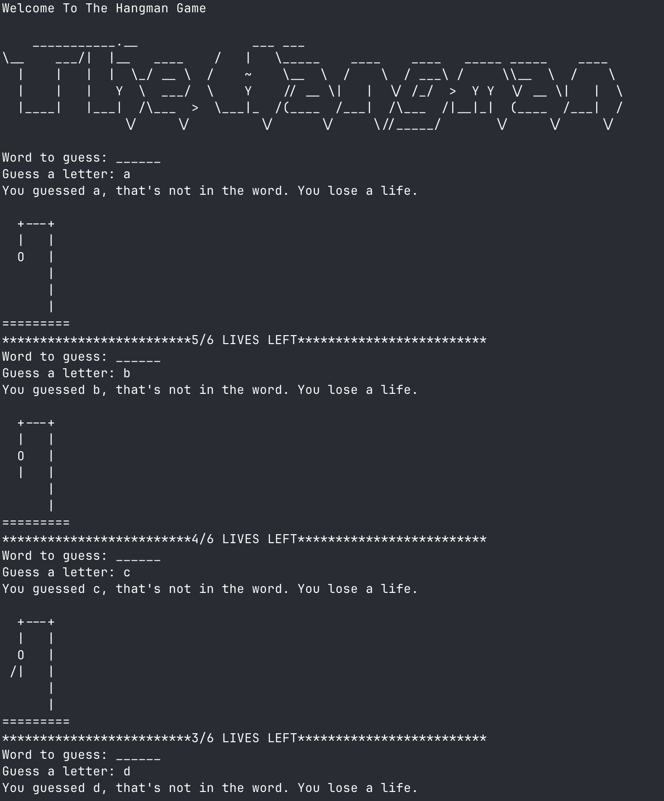
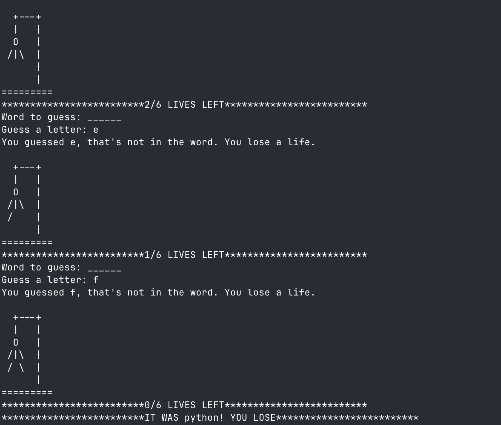

<h1 align="center">Hangman CLI Game</h1>

<p align="center">
  
  
  
</p>

<p align="center">
  
</p>

<h3 align="center">
  Guess the hidden animal before the ASCII hangman is complete.
</h3>

---

## 📘 About The Project

The **Hangman CLI Game** is a terminal-based word guessing challenge built with Python.  
It allows users to:

- Practice deduction by guessing letters from curated animal names  
- See real-time ASCII hangman states with every wrong guess  
- Learn Python control flow concepts in a playful setting  

This project is perfect for:

- Python beginners working through 100 Days of Code  
- Educators needing a concise in-class demo  
- CLI enthusiasts who enjoy classic games in the terminal  

---

### 💡 Why This Project Exists

Many existing hangman CLI scripts are limited because:

- They depend on external APIs for word lists  
- The UX is cluttered or lacks clear life indicators  
- The codebase is difficult for learners to extend  

This project aims to solve that by providing:

- A self-contained word pool and ASCII art module  
- Straightforward prompts with explicit life tracking  
- Cleanly structured logic that is easy to expand  

It also serves as a solid foundation for future improvements.

---

## 🖼 Screenshot

  

---

## 🛠 Tech Stack

| Technology | Usage |
|-----------|--------|
| 🐍 **Python 3** | Core language that powers the game loop |
| 🔧 **random** | Selects unpredictable words from the list |
| 💻 **CLI** | Keeps the interaction lightweight and portable |
| 🧹 **ASCII art module** | Renders the hangman board state |

---

## ✨ Key Features

- 🚀 **Instant Play** — run `python main.py` and start guessing immediately  
- ⚙️ **Robust Word Pool** — dozens of animal names keep each round fresh  
- 📦 **ASCII Feedback** — visual hangman stages create tension per miss  
- 🔁 **Replay Friendly** — automatic word selection encourages repeat runs  
- 🧹 **Zero Dependencies** — standard-library only, so nothing extra to install  

---

## 🚀 Getting Started

### ✅ Prerequisites

You need:

- Python **3.10+**
- Git (optional if downloading ZIP)

---

### 📦 Installation

Clone the repo:

```bash
git clone https://github.com/ZygmaCore/hangman-cli.git
cd hangman-cli
```

(Optional) Create virtual environment (if using Python):

```bash
python -m venv .venv
# macOS/Linux
source .venv/bin/activate
# Windows
.venv\Scripts\activate
```

---

## ▶️ Usage

Run the application:

```bash
python main.py
```

Example output:

```
Welcome To The Hangman Game
Word to guess: ______
Guess a letter: a
You guessed a, that's not in the word. You lose a life.
* * * * * * * * * * * * * * * * * * * * * * * *1/6 LIVES LEFT* * * * * * * * * * * * * * * * * * * * * * * *
Word to guess: ______
```

---

## 🤝 Contributing

Contributions are always welcome!

Ideas you can add:

- Difficulty levels with fewer lives  
- Colorized terminal output  
- Alternate word categories  

Steps to contribute:

1. Fork the repo  
2. Create a new branch  
3. Commit your changes  
4. Push the branch  
5. Open a pull request 🚀  

---

## 📄 License & Contact

This project is licensed under the **MIT License**.  
See the `LICENSE` file for details.

**Author Contact:**  
🌐 https://alhikam.me  
🐙 https://github.com/ZygmaCore
